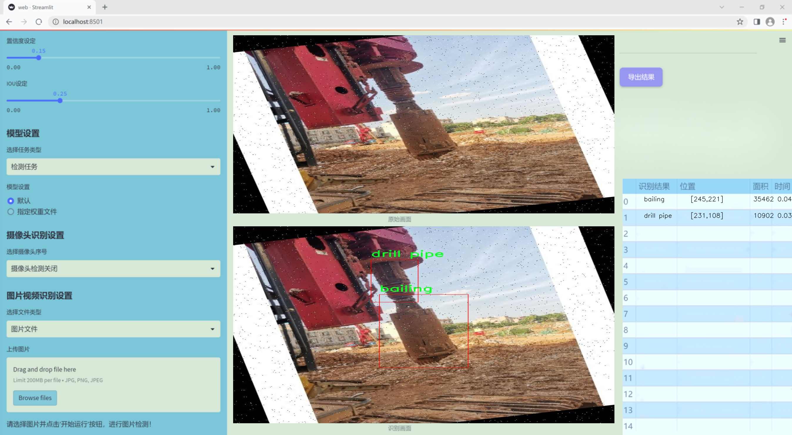
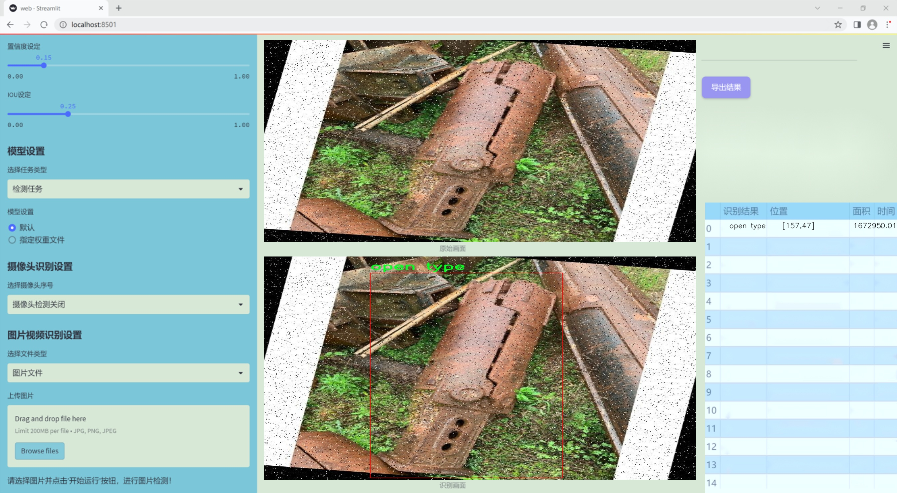
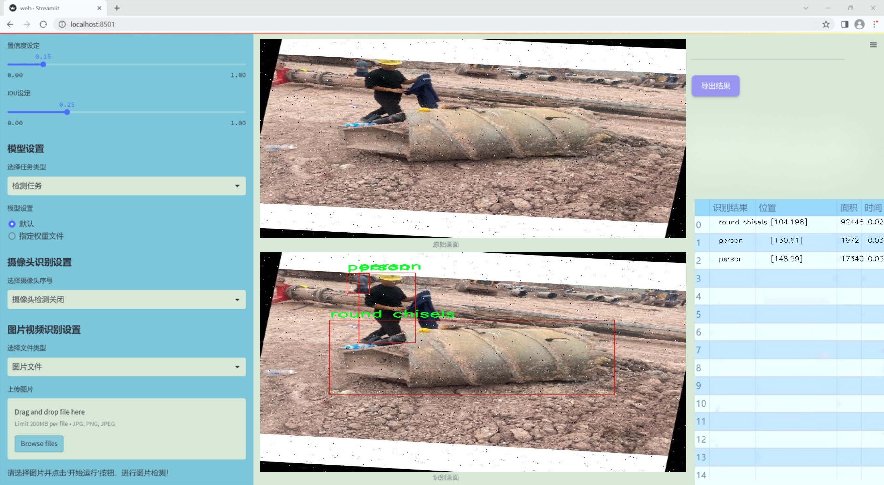
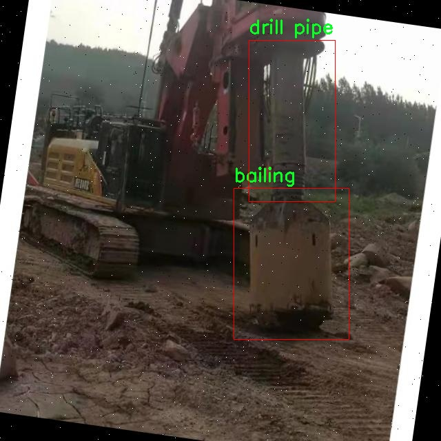
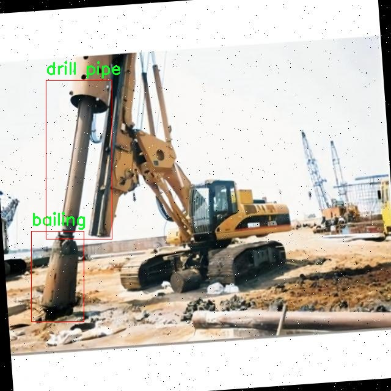
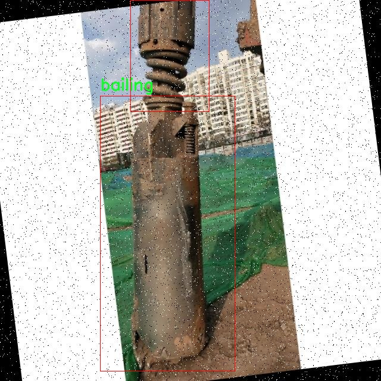
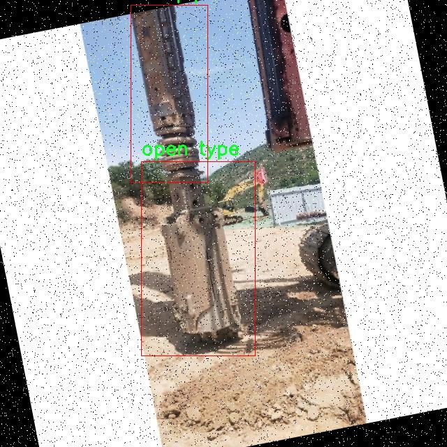
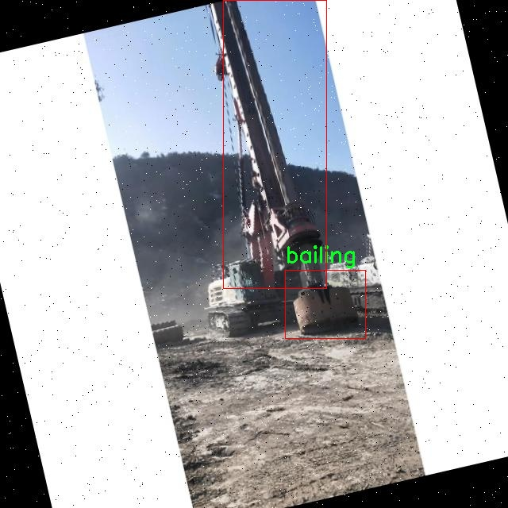

# 改进yolo11-RCSOSA等200+全套创新点大全：工地施工机械检测系统源码＆数据集全套

### 1.图片效果展示







##### 项目来源 **[人工智能促进会 2024.10.24](https://kdocs.cn/l/cszuIiCKVNis)**

注意：由于项目一直在更新迭代，上面“1.图片效果展示”和“2.视频效果展示”展示的系统图片或者视频可能为老版本，新版本在老版本的基础上升级如下：（实际效果以升级的新版本为准）

  （1）适配了YOLOV11的“目标检测”模型和“实例分割”模型，通过加载相应的权重（.pt）文件即可自适应加载模型。

  （2）支持“图片识别”、“视频识别”、“摄像头实时识别”三种识别模式。

  （3）支持“图片识别”、“视频识别”、“摄像头实时识别”三种识别结果保存导出，解决手动导出（容易卡顿出现爆内存）存在的问题，识别完自动保存结果并导出到tempDir中。

  （4）支持Web前端系统中的标题、背景图等自定义修改。

  另外本项目提供训练的数据集和训练教程,暂不提供权重文件（best.pt）,需要您按照教程进行训练后实现图片演示和Web前端界面演示的效果。

### 2.视频效果展示

[2.1 视频效果展示](https://www.bilibili.com/video/BV1Rv1aYMEkn/)

### 3.背景

研究背景与意义

随着城市化进程的加快，建筑施工活动日益频繁，工地安全管理和施工效率的提升成为亟待解决的重要课题。传统的工地机械检测方法往往依赖人工巡查，不仅效率低下，而且容易受到人为因素的影响，导致安全隐患的增加。因此，基于计算机视觉的自动化检测系统应运而生，成为提升工地安全管理和施工效率的重要手段。YOLO（You Only Look Once）系列模型因其高效的实时目标检测能力，广泛应用于各类视觉识别任务中，尤其在复杂的工地环境中，能够快速、准确地识别施工机械及其操作人员。

本研究旨在基于改进的YOLOv11模型，构建一个高效的工地施工机械检测系统。该系统将针对特定的施工机械，如钻孔铲、钻杆、滚轮刀具等进行检测，利用2100张标注图像构建的数据集，涵盖了两类主要目标：施工机械和人员。这一数据集不仅提供了丰富的样本数量，还包含了多种类的施工机械，能够有效支持模型的训练与优化。通过对YOLOv11模型的改进，提升其在复杂环境下的检测精度和速度，使其能够实时监控工地上的机械使用情况，及时发现潜在的安全隐患。

此外，随着人工智能技术的不断发展，基于深度学习的目标检测系统将为工地管理提供新的解决方案，推动建筑行业的智能化进程。通过本研究的实施，不仅可以提高工地的安全管理水平，还能够为施工效率的提升提供数据支持，最终实现智能化施工的目标。因此，本项目具有重要的理论意义和实际应用价值，能够为未来的工地安全管理和施工技术发展提供有力的支撑。

### 4.数据集信息展示

##### 4.1 本项目数据集详细数据（类别数＆类别名）

nc: 6
names: ['bailing', 'drill pipe', 'open type', 'person', 'roller bits', 'round chisels']


该项目为【目标检测】数据集，请在【训练教程和Web端加载模型教程（第三步）】这一步的时候按照【目标检测】部分的教程来训练

##### 4.2 本项目数据集信息介绍

本项目数据集信息介绍

本项目旨在改进YOLOv11的工地施工机械检测系统，所使用的数据集名为“drilling bucket”。该数据集专注于工地施工环境中常见的机械设备和人员，包含六个主要类别，分别为“bailing”、“drill pipe”、“open type”、“person”、“roller bits”和“round chisels”。这些类别的选择不仅涵盖了施工现场的关键机械设备，还考虑到了工人安全和操作的相关性，为系统的训练提供了丰富的多样性。

“drilling bucket”数据集的构建基于真实工地环境的拍摄，确保了数据的真实性和有效性。每个类别的样本均经过精心标注，以确保模型在训练过程中能够准确识别和分类不同的物体。例如，“bailing”类别代表了在施工过程中常用的排水设备，而“drill pipe”则是钻探作业中不可或缺的工具。通过对这些类别的深入学习，改进后的YOLOv11模型将能够在复杂的施工环境中高效地检测和识别各种机械设备及人员，提高施工安全性和效率。

此外，数据集的多样性和丰富性也为模型的泛化能力提供了保障。不同的拍摄角度、光照条件和背景环境，使得模型在面对实际工地的复杂情况时，能够更好地适应和应对。通过利用“drilling bucket”数据集，项目不仅期望提升机械检测的准确性，还希望为工地施工管理提供更为智能化的解决方案，从而推动施工行业的数字化转型和智能化发展。











### 5.全套项目环境部署视频教程（零基础手把手教学）

[5.1 所需软件PyCharm和Anaconda安装教程（第一步）](https://www.bilibili.com/video/BV1BoC1YCEKi/?spm_id_from=333.999.0.0&vd_source=bc9aec86d164b67a7004b996143742dc)


[5.2 安装Python虚拟环境创建和依赖库安装视频教程（第二步）](https://www.bilibili.com/video/BV1ZoC1YCEBw?spm_id_from=333.788.videopod.sections&vd_source=bc9aec86d164b67a7004b996143742dc)

### 6.改进YOLOv11训练教程和Web_UI前端加载模型教程（零基础手把手教学）

[6.1 改进YOLOv11训练教程和Web_UI前端加载模型教程（第三步）](https://www.bilibili.com/video/BV1BoC1YCEhR?spm_id_from=333.788.videopod.sections&vd_source=bc9aec86d164b67a7004b996143742dc)


按照上面的训练视频教程链接加载项目提供的数据集，运行train.py即可开始训练



     Epoch   gpu_mem       box       obj       cls    labels  img_size
     1/200     20.8G   0.01576   0.01955  0.007536        22      1280: 100%|██████████| 849/849 [14:42<00:00,  1.04s/it]
               Class     Images     Labels          P          R     mAP@.5 mAP@.5:.95: 100%|██████████| 213/213 [01:14<00:00,  2.87it/s]
                 all       3395      17314      0.994      0.957      0.0957      0.0843

     Epoch   gpu_mem       box       obj       cls    labels  img_size
     2/200     20.8G   0.01578   0.01923  0.007006        22      1280: 100%|██████████| 849/849 [14:44<00:00,  1.04s/it]
               Class     Images     Labels          P          R     mAP@.5 mAP@.5:.95: 100%|██████████| 213/213 [01:12<00:00,  2.95it/s]
                 all       3395      17314      0.996      0.956      0.0957      0.0845

     Epoch   gpu_mem       box       obj       cls    labels  img_size
     3/200     20.8G   0.01561    0.0191  0.006895        27      1280: 100%|██████████| 849/849 [10:56<00:00,  1.29it/s]
               Class     Images     Labels          P          R     mAP@.5 mAP@.5:.95: 100%|███████   | 187/213 [00:52<00:00,  4.04it/s]
                 all       3395      17314      0.996      0.957      0.0957      0.0845


###### [项目数据集下载链接](https://kdocs.cn/l/cszuIiCKVNis)

### 7.原始YOLOv11算法讲解


ultralytics发布了最新的作品YOLOv11，这一次YOLOv11的变化相对于ultralytics公司的上一代作品YOLOv8变化不是很大的（YOLOv9、YOLOv10均不是ultralytics公司作品），其中改变的位置涉及到C2f变为C3K2，在SPPF后面加了一层类似于注意力机制的C2PSA，还有一个变化大家从yaml文件是看不出来的就是它的检测头内部替换了两个DWConv，以及模型的深度和宽度参数进行了大幅度调整，但是在损失函数方面就没有变化还是采用的CIoU作为边界框回归损失，下面带大家深入理解一下ultralytics最新作品YOLOv11的创新点。

**下图为最近的YOLO系列发布时间线！**


* * *

###### YOLOv11和YOLOv8对比

在YOLOYOLOv5，YOLOv8，和YOLOv11是ultralytics公司作品（ultralytics出品必属精品），下面用一张图片从yaml文件来带大家对比一下YOLOv8和YOLOv11的区别，配置文件变得内容比较少大家可以看一卡，左侧为YOLOv8右侧为YOLOv11，不同的点我用黑线标注了出来。


* * *

###### YOLOv11的网络结构解析

下面的图片为YOLOv11的网络结构图。


**其中主要创新点可以总结如下- > **

* * *

1\.
提出C3k2机制，其中C3k2有参数为c3k，其中在网络的浅层c3k设置为False（下图中可以看到c3k2第二个参数被设置为False，就是对应的c3k参数）。


此时所谓的C3k2就相当于YOLOv8中的C2f，其网络结构为一致的，其中的C3k机制的网络结构图如下图所示
**（为什么叫C3k2，我个人理解是因为C3k的调用时C3k其中的参数N固定设置为2的原因，个人理解不一定对** ）。


* * *

2\.
第二个创新点是提出C2PSA机制，这是一个C2（C2f的前身）机制内部嵌入了一个多头注意力机制，在这个过程中我还发现作者尝试了C2fPSA机制但是估计效果不如C2PSA，有的时候机制有没有效果理论上真的很难解释通，下图为C2PSA机制的原理图，仔细观察把Attention哪里去掉则C2PSA机制就变为了C2所以我上面说C2PSA就是C2里面嵌入了一个PSA机制。


* * *

3\.
第三个创新点可以说是原先的解耦头中的分类检测头增加了两个DWConv，具体的对比大家可以看下面两个图下面的是YOLOv11的解耦头，上面的是YOLOv8的解耦头.


我们上面看到了在分类检测头中YOLOv11插入了两个DWConv这样的做法可以大幅度减少参数量和计算量（原先两个普通的Conv大家要注意到卷积和是由3变为了1的，这是形成了两个深度可分离Conv），大家可能不太理解为什么加入了两个DWConv还能够减少计算量，以及什么是深度可分离Conv，下面我来解释一下。

> **`DWConv` 代表 Depthwise
> Convolution（深度卷积）**，是一种在卷积神经网络中常用的高效卷积操作。它主要用于减少计算复杂度和参数量，尤其在移动端或轻量化网络（如
> MobileNet）中十分常见。
>
> **1\. 标准卷积的计算过程**
>
> 在标准卷积操作中，对于一个输入张量（通常是一个多通道的特征图），卷积核的尺寸是 `(h, w, C_in)`，其中 `h` 和 `w`
> 是卷积核的空间尺寸，`C_in`
> 是输入通道的数量。而卷积核与输入张量做的是完整的卷积运算，每个输出通道都与所有输入通道相连并参与卷积操作，导致计算量比较大。
>
> 标准卷积的计算过程是这样的：
>
>   * 每个输出通道是所有输入通道的组合（加权求和），卷积核在每个位置都会计算与所有输入通道的点积。
>   * 假设有 `C_in` 个输入通道和 `C_out` 个输出通道，那么卷积核的总参数量是 `C_in * C_out * h * w`。
>

>
> 2\. **Depthwise Convolution（DWConv）**
>
> 与标准卷积不同， **深度卷积** 将输入的每个通道单独处理，即 **每个通道都有自己的卷积核进行卷积**
> ，不与其他通道进行交互。它可以被看作是标准卷积的一部分，专注于空间维度上的卷积运算。
>
> **深度卷积的计算过程：**
>
>   * 假设输入张量有 `C_in` 个通道，每个通道会使用一个 `h × w`
> 的卷积核进行卷积操作。这个过程称为“深度卷积”，因为每个通道独立进行卷积运算。
>   * 输出的通道数与输入通道数一致，每个输出通道只和对应的输入通道进行卷积，没有跨通道的组合。
>   * 参数量和计算量相比标准卷积大大减少，卷积核的参数量是 `C_in * h * w`。
>

>
> **深度卷积的优点：**
>
>   1. **计算效率高** ：相对于标准卷积，深度卷积显著减少了计算量。它只处理空间维度上的卷积，不再处理通道间的卷积。
>   2.  **参数量减少** ：由于每个卷积核只对单个通道进行卷积，参数量大幅减少。例如，标准卷积的参数量为 `C_in * C_out * h *
> w`，而深度卷积的参数量为 `C_in * h * w`。
>   3.  **结合点卷积可提升效果** ：为了弥补深度卷积缺乏跨通道信息整合的问题，通常深度卷积后会配合 `1x1` 的点卷积（Pointwise
> Convolution）使用，通过 `1x1` 的卷积核整合跨通道的信息。这种组合被称为 **深度可分离卷积** （Depthwise
> Separable Convolution） | **这也是我们本文YOLOv11中的做法** 。
>

>
> 3\. **深度卷积与标准卷积的区别**
>
> 操作类型| 卷积核大小| 输入通道数| 输出通道数| 参数量  
> ---|---|---|---|---  
> 标准卷积| `h × w`| `C_in`| `C_out`| `C_in * C_out * h * w`  
> 深度卷积（DWConv）| `h × w`| `C_in`| `C_in`| `C_in * h * w`  
>  
> 可以看出，深度卷积在相同的卷积核大小下，参数量减少了约 `C_out` 倍
> （细心的人可以发现用最新版本的ultralytics仓库运行YOLOv8参数量相比于之前的YOLOv8以及大幅度减少了这就是因为检测头改了的原因但是名字还是Detect，所以如果你想继续用YOLOv8发表论文做实验那么不要更新最近的ultralytics仓库）。
>
> **4\. 深度可分离卷积 (Depthwise Separable Convolution)**
>
> 深度卷积常与 `1x1` 的点卷积配合使用，这称为深度可分离卷积。其过程如下：
>
>   1. 先对输入张量进行深度卷积，对每个通道独立进行空间卷积。
>   2. 然后通过 `1x1` 点卷积，对通道维度进行混合，整合不同通道的信息。
>

>
> 这样既可以保证计算量的减少，又可以保持跨通道的信息流动。
>
> 5\. **总结**
>
> `DWConv` 是一种高效的卷积方式，通过单独处理每个通道来减少计算量，结合 `1x1`
> 的点卷积，形成深度可分离卷积，可以在保持网络性能的同时极大地减少模型的计算复杂度和参数量。

**看到这里大家应该明白了为什么加入了两个DWConv还能减少参数量以及YOLOv11的检测头创新点在哪里。**

* * *

##### YOLOv11和YOLOv8还有一个不同的点就是其各个版本的模型（N - S - M- L - X）网络深度和宽度变了


可以看到在深度（depth）和宽度
（width）两个地方YOLOv8和YOLOv11是基本上完全不同了，这里我理解这么做的含义就是模型网络变小了，所以需要加深一些模型的放缩倍数来弥补模型之前丧失的能力从而来达到一个平衡。

> **本章总结：**
> YOLOv11的改进点其实并不多更多的都是一些小的结构上的创新，相对于之前的YOLOv5到YOLOv8的创新，其实YOLOv11的创新点不算多，但是其是ultralytics公司的出品，同时ultralytics仓库的使用量是非常多的（不像YOLOv9和YOLOv10）所以在未来的很长一段时间内其实YOLO系列估计不会再更新了，YOLOv11作为最新的SOTA肯定是十分适合大家来发表论文和创新的。
>

### 8.200+种全套改进YOLOV11创新点原理讲解

#### 8.1 200+种全套改进YOLOV11创新点原理讲解大全

由于篇幅限制，每个创新点的具体原理讲解就不全部展开，具体见下列网址中的改进模块对应项目的技术原理博客网址【Blog】（创新点均为模块化搭建，原理适配YOLOv5~YOLOv11等各种版本）

[改进模块技术原理博客【Blog】网址链接](https://gitee.com/qunmasj/good)


#### 8.2 精选部分改进YOLOV11创新点原理讲解

###### 这里节选部分改进创新点展开原理讲解(完整的改进原理见上图和[改进模块技术原理博客链接](https://gitee.com/qunmasj/good)【如果此小节的图加载失败可以通过CSDN或者Github搜索该博客的标题访问原始博客，原始博客图片显示正常】

### Gold-YOLO


#### Preliminaries
YOLO系列的中间层结构采用了传统的FPN结构，其中包含多个分支用于多尺度特征融合。然而，它只充分融合来自相邻级别的特征，对于其他层次的信息只能间接地进行“递归”获取。

传统的FPN结构在信息传输过程中存在丢失大量信息的问题。这是因为层之间的信息交互仅限于中间层选择的信息，未被选择的信息在传输过程中被丢弃。这种情况导致某个Level的信息只能充分辅助相邻层，而对其他全局层的帮助较弱。因此，整体上信息融合的有效性可能受到限制。
为了避免在传输过程中丢失信息，本文采用了一种新颖的“聚集和分发”机制（GD），放弃了原始的递归方法。该机制使用一个统一的模块来收集和融合所有Level的信息，并将其分发到不同的Level。通过这种方式，作者不仅避免了传统FPN结构固有的信息丢失问题，还增强了中间层的部分信息融合能力，而且并没有显著增加延迟。


#### 低阶聚合和分发分支 Low-stage gather-and-distribute branch
从主干网络中选择输出的B2、B3、B4、B5特征进行融合，以获取保留小目标信息的高分辨率特征。


#### 高阶聚合和分发分支 High-stage gather-and-distribute branch
高级全局特征对齐模块（High-GD）将由低级全局特征对齐模块（Low-GD）生成的特征{P3, P4, P5}进行融合。


Transformer融合模块由多个堆叠的transformer组成，transformer块的数量为L。每个transformer块包括一个多头注意力块、一个前馈网络（FFN）和残差连接。采用与LeViT相同的设置来配置多头注意力块，使用16个通道作为键K和查询Q的头维度，32个通道作为值V的头维度。为了加速推理过程，将层归一化操作替换为批归一化，并将所有的GELU激活函数替换为ReLU。为了增强变换器块的局部连接，在两个1x1卷积层之间添加了一个深度卷积层。同时，将FFN的扩展因子设置为2，以在速度和计算成本之间取得平衡。


信息注入模块(Information injection module)： 高级全局特征对齐模块（High-GD）中的信息注入模块与低级全局特征对齐模块（Low-GD）中的相同。在高级阶段，局部特征（Flocal）等于Pi，因此公式如下所示：


#### 增强的跨层信息流动 Enhanced cross-layer information flow
为了进一步提升性能，从YOLOv6 中的PAFPN模块中得到启发，引入了Inject-LAF模块。该模块是注入模块的增强版，包括了一个轻量级相邻层融合（LAF）模块，该模块被添加到注入模块的输入位置。为了在速度和准确性之间取得平衡，设计了两个LAF模型：LAF低级模型和LAF高级模型，分别用于低级注入（合并相邻两层的特征）和高级注入（合并相邻一层的特征）。它们的结构如图5(b)所示。为了确保来自不同层级的特征图与目标大小对齐，在实现中的两个LAF模型仅使用了三个操作符：双线性插值（上采样过小的特征）、平均池化（下采样过大的特征）和1x1卷积（调整与目标通道不同的特征）。模型中的LAF模块与信息注入模块的结合有效地平衡了准确性和速度之间的关系。通过使用简化的操作，能够增加不同层级之间的信息流路径数量，从而提高性能而不显著增加延迟。


### 9.系统功能展示

图9.1.系统支持检测结果表格显示

  图9.2.系统支持置信度和IOU阈值手动调节

  图9.3.系统支持自定义加载权重文件best.pt(需要你通过步骤5中训练获得)

  图9.4.系统支持摄像头实时识别

  图9.5.系统支持图片识别

  图9.6.系统支持视频识别

  图9.7.系统支持识别结果文件自动保存

  图9.8.系统支持Excel导出检测结果数据


### 10. YOLOv11核心改进源码讲解

#### 10.1 test_selective_scan.py

以下是代码中最核心的部分，并附上详细的中文注释：

```python
import torch
import torch.nn.functional as F

def build_selective_scan_fn(selective_scan_cuda: object = None, mode="mamba_ssm"):
    """
    构建选择性扫描函数，使用指定的CUDA实现和模式。
    
    参数:
    selective_scan_cuda: CUDA实现的选择性扫描函数
    mode: 模式名称，用于选择不同的实现
    """
    
    class SelectiveScanFn(torch.autograd.Function):
        @staticmethod
        def forward(ctx, u, delta, A, B, C, D=None, z=None, delta_bias=None, delta_softplus=False, return_last_state=False):
            """
            前向传播函数，执行选择性扫描操作。
            
            参数:
            ctx: 上下文对象，用于保存状态
            u: 输入张量
            delta: 输入增量
            A, B, C: 权重张量
            D: 可选的偏置张量
            z: 可选的张量
            delta_bias: 可选的增量偏置
            delta_softplus: 是否使用softplus激活
            return_last_state: 是否返回最后状态
            
            返回:
            输出张量或输出和最后状态的元组
            """
            # 确保输入张量是连续的
            if u.stride(-1) != 1:
                u = u.contiguous()
            if delta.stride(-1) != 1:
                delta = delta.contiguous()
            if D is not None:
                D = D.contiguous()
            if B.stride(-1) != 1:
                B = B.contiguous()
            if C.stride(-1) != 1:
                C = C.contiguous()
            if z is not None and z.stride(-1) != 1:
                z = z.contiguous()

            # 进行选择性扫描的CUDA调用
            out, x, *rest = selective_scan_cuda.fwd(u, delta, A, B, C, D, z, delta_bias, delta_softplus)

            # 保存必要的张量以供反向传播使用
            ctx.save_for_backward(u, delta, A, B, C, D, delta_bias, x)

            # 返回输出或输出和最后状态
            last_state = x[:, :, -1, 1::2]  # 取最后状态
            return out if not return_last_state else (out, last_state)

        @staticmethod
        def backward(ctx, dout):
            """
            反向传播函数，计算梯度。
            
            参数:
            ctx: 上下文对象，包含前向传播时保存的状态
            dout: 输出的梯度
            
            返回:
            输入张量的梯度
            """
            # 从上下文中恢复保存的张量
            u, delta, A, B, C, D, delta_bias, x = ctx.saved_tensors
            
            # 调用CUDA实现的反向传播
            du, ddelta, dA, dB, dC, dD, ddelta_bias = selective_scan_cuda.bwd(u, delta, A, B, C, D, delta_bias, dout, x)

            return du, ddelta, dA, dB, dC, dD, ddelta_bias

    def selective_scan_fn(u, delta, A, B, C, D=None, z=None, delta_bias=None, delta_softplus=False, return_last_state=False):
        """
        选择性扫描函数的接口，调用选择性扫描的前向和反向传播。
        
        参数:
        u, delta, A, B, C, D, z, delta_bias, delta_softplus, return_last_state: 同上
        
        返回:
        输出张量或输出和最后状态的元组
        """
        return SelectiveScanFn.apply(u, delta, A, B, C, D, z, delta_bias, delta_softplus, return_last_state)

    return selective_scan_fn

# 示例调用
selective_scan_fn = build_selective_scan_fn(selective_scan_cuda=None, mode="mamba_ssm")
```

### 代码核心部分说明：
1. **`build_selective_scan_fn`**: 该函数用于构建选择性扫描的函数，并返回一个可用于前向和反向传播的自定义函数。
2. **`SelectiveScanFn`**: 这是一个继承自`torch.autograd.Function`的类，定义了前向和反向传播的操作。
   - **`forward`**: 实现了选择性扫描的前向传播逻辑，调用CUDA实现的前向函数，并保存必要的张量以供反向传播使用。
   - **`backward`**: 实现了反向传播逻辑，计算输入张量的梯度。
3. **`selective_scan_fn`**: 这是一个接口函数，调用`SelectiveScanFn`的`apply`方法，简化了用户的调用方式。

通过以上注释，您可以理解代码的主要结构和功能。

这个程序文件 `test_selective_scan.py` 主要实现了一个选择性扫描（Selective Scan）功能，并包含了相关的测试代码。选择性扫描是一种在序列数据上进行计算的技术，常用于处理时间序列、序列建模等任务。以下是对文件内容的详细说明。

首先，文件导入了一些必要的库，包括 `torch`、`pytest` 和 `einops`，这些库为张量操作、自动求导和重排提供了支持。接着，定义了一个 `build_selective_scan_fn` 函数，用于构建选择性扫描的前向和反向传播功能。这个函数接受一个 CUDA 实现的选择性扫描函数和一些其他参数。

在 `build_selective_scan_fn` 函数内部，定义了一个名为 `SelectiveScanFn` 的类，继承自 `torch.autograd.Function`。这个类包含两个静态方法：`forward` 和 `backward`。`forward` 方法实现了选择性扫描的前向计算逻辑，处理输入张量的维度和数据类型，并调用 CUDA 实现的前向函数进行计算。它还支持一些可选参数，比如 `return_last_state`，用于返回最后的状态。

`backward` 方法实现了反向传播的逻辑，计算梯度并返回。它会根据输入的不同情况，调用相应的 CUDA 实现的反向函数来计算梯度。

接下来，定义了 `selective_scan_ref` 和 `selective_scan_ref_v2` 函数，这两个函数实现了选择性扫描的参考实现，主要用于与 CUDA 实现进行结果对比。它们的输入参数与前面的 `forward` 方法相似，返回计算结果和最后状态。

在文件的后半部分，设置了不同的模式（MODE），并根据模式导入相应的 CUDA 实现。通过调用 `build_selective_scan_fn` 函数，构建出适合当前模式的选择性扫描函数。

最后，使用 `pytest` 框架定义了一个测试函数 `test_selective_scan`，该函数通过参数化测试不同的输入条件，验证选择性扫描的实现是否正确。测试中生成了随机输入数据，并与参考实现的输出进行比较，确保两者的结果在可接受的误差范围内。

总的来说，这个程序文件实现了选择性扫描的前向和反向传播功能，并通过测试确保其正确性，适用于深度学习模型中的序列数据处理。

#### 10.2 test_selective_scan_easy.py

以下是代码中最核心的部分，并附上详细的中文注释：

```python
import torch
import torch.nn.functional as F

def selective_scan_easy(us, dts, As, Bs, Cs, Ds, delta_bias=None, delta_softplus=False, return_last_state=False, chunksize=64):
    """
    选择性扫描函数，执行一系列操作以计算输出。
    
    参数：
    us: 输入张量，形状为 (B, G * D, L)
    dts: 时间增量张量，形状为 (B, G * D, L)
    As: 矩阵 A，形状为 (G * D, N)
    Bs: 矩阵 B，形状为 (B, G, N, L)
    Cs: 矩阵 C，形状为 (B, G, N, L)
    Ds: 矩阵 D，形状为 (G * D)
    delta_bias: 可选的偏置，形状为 (G * D)
    delta_softplus: 是否应用 softplus 函数
    return_last_state: 是否返回最后的状态
    chunksize: 每次处理的块大小
    """
    
    def selective_scan_chunk(us, dts, As, Bs, Cs, hprefix):
        """
        处理每个块的选择性扫描逻辑。
        
        参数：
        us: 输入张量的一个块
        dts: 时间增量张量的一个块
        As: 矩阵 A
        Bs: 矩阵 B 的一个块
        Cs: 矩阵 C 的一个块
        hprefix: 前一个状态的输出
        
        返回：
        ys: 当前块的输出
        hs: 当前块的状态
        """
        ts = dts.cumsum(dim=0)  # 计算时间增量的累积和
        Ats = torch.einsum("gdn,lbgd->lbgdn", As, ts).exp()  # 计算 A 的指数
        scale = 1  # 缩放因子
        rAts = Ats / scale  # 归一化的 A
        duts = dts * us  # 计算 duts
        dtBus = torch.einsum("lbgd,lbgn->lbgdn", duts, Bs)  # 计算 dtBus
        hs_tmp = rAts * (dtBus / rAts).cumsum(dim=0)  # 计算状态
        hs = hs_tmp + Ats * hprefix.unsqueeze(0)  # 更新状态
        ys = torch.einsum("lbgn,lbgdn->lbgd", Cs, hs)  # 计算输出
        return ys, hs

    # 处理输入数据类型和形状
    dtype = torch.float32
    inp_dtype = us.dtype
    has_D = Ds is not None
    if chunksize < 1:
        chunksize = Bs.shape[-1]

    dts = dts.to(dtype)  # 转换数据类型
    if delta_bias is not None:
        dts = dts + delta_bias.view(1, -1, 1).to(dtype)  # 应用偏置
    if delta_softplus:
        dts = F.softplus(dts)  # 应用 softplus 函数

    # 调整输入张量的形状
    if len(Bs.shape) == 3:
        Bs = Bs.unsqueeze(1)
    if len(Cs.shape) == 3:
        Cs = Cs.unsqueeze(1)
    B, G, N, L = Bs.shape
    us = us.view(B, G, -1, L).permute(3, 0, 1, 2).to(dtype)
    dts = dts.view(B, G, -1, L).permute(3, 0, 1, 2).to(dtype)
    As = As.view(G, -1, N).to(dtype)
    Bs = Bs.permute(3, 0, 1, 2).to(dtype)
    Cs = Cs.permute(3, 0, 1, 2).to(dtype)
    Ds = Ds.view(G, -1).to(dtype) if has_D else None
    D = As.shape[1]

    oys = []  # 存储输出
    hprefix = us.new_zeros((B, G, D, N), dtype=dtype)  # 初始化前一个状态
    for i in range(0, L, chunksize):
        ys, hs = selective_scan_chunk(
            us[i:i + chunksize], dts[i:i + chunksize], 
            As, Bs[i:i + chunksize], Cs[i:i + chunksize], hprefix, 
        )
        oys.append(ys)  # 收集输出
        hprefix = hs[-1]  # 更新前一个状态

    oys = torch.cat(oys, dim=0)  # 合并所有输出
    if has_D:
        oys = oys + Ds * us  # 如果有 D，更新输出
    oys = oys.permute(1, 2, 3, 0).view(B, -1, L)  # 调整输出形状

    return oys.to(inp_dtype) if not return_last_state else (oys.to(inp_dtype), hprefix.view(B, G * D, N).float())
```

### 代码说明
1. **selective_scan_easy**: 这是主要的选择性扫描函数，接收多个输入参数并执行计算。它分为多个块进行处理，以便更好地管理内存和计算效率。
2. **selective_scan_chunk**: 这是一个内部函数，用于处理每个块的选择性扫描逻辑。它计算当前块的输出和状态。
3. **数据处理**: 代码中包含了对输入数据类型和形状的处理，确保输入张量的维度和类型符合预期。
4. **输出合并**: 在处理完所有块后，输出会被合并并返回。

通过这种方式，代码实现了高效的选择性扫描操作，适用于需要逐步计算状态的场景。

这个程序文件 `test_selective_scan_easy.py` 实现了一个名为 `selective_scan_easy` 的函数，并且使用 PyTorch 进行张量运算。该函数主要用于处理时间序列数据的选择性扫描（Selective Scan），并且支持多种输入参数配置。以下是对代码的详细说明。

首先，程序导入了必要的库，包括 `math`、`functools`、`torch`、`torch.nn.functional`、`pytest` 和 `einops`。这些库提供了数学运算、函数式编程、深度学习操作、测试框架和张量重排功能。

接下来，定义了 `selective_scan_easy` 函数，该函数接受多个参数，包括输入张量 `us`、`dts`、`As`、`Bs`、`Cs`、`Ds`，以及一些可选参数如 `delta_bias`、`delta_softplus`、`return_last_state` 和 `chunksize`。函数内部定义了一个嵌套函数 `selective_scan_chunk`，用于处理输入数据的分块计算。

在 `selective_scan_easy` 函数中，首先进行数据类型的转换和形状调整，以确保输入张量的维度符合预期。然后，函数通过循环将输入数据分块处理，每个块的大小由 `chunksize` 参数决定。在每个块内，调用 `selective_scan_chunk` 函数进行计算，并将结果存储在 `oys` 列表中。最后，函数将所有块的结果合并，并根据需要添加偏置项。

`SelectiveScanEasy` 类继承自 `torch.autograd.Function`，用于实现自定义的前向和反向传播操作。该类的 `forward` 方法实现了选择性扫描的前向计算，而 `backward` 方法则实现了反向传播的梯度计算。在前向计算中，输入数据被处理并返回输出结果和最后的状态。在反向传播中，计算每个输入张量的梯度，并将其返回。

程序还定义了多个辅助函数，如 `selective_scan_easy_fwdbwd`、`selective_scan_easyv2` 和 `selective_scan_easyv3`，这些函数实现了不同版本的选择性扫描逻辑，以满足不同的需求和性能要求。

最后，程序使用 `pytest` 框架定义了一个测试函数 `test_selective_scan`，通过参数化的方式测试 `selective_scan_easy` 函数的正确性。测试涵盖了多种输入配置，包括不同的数据类型、序列长度、是否使用偏置等。测试的结果通过断言来验证输出的正确性，并检查梯度计算的准确性。

整体来看，这个程序实现了一个复杂的选择性扫描算法，支持多种输入配置，并通过单元测试确保了功能的正确性和稳定性。

#### 10.3 block.py

以下是保留的核心代码部分，并附上详细的中文注释：

```python
import torch
import torch.nn as nn
import torch.nn.functional as F

def autopad(k, p=None, d=1):  # kernel, padding, dilation
    """自动填充以保持输出形状不变。"""
    if d > 1:
        k = d * (k - 1) + 1 if isinstance(k, int) else [d * (x - 1) + 1 for x in k]  # 实际的卷积核大小
    if p is None:
        p = k // 2 if isinstance(k, int) else [x // 2 for x in k]  # 自动填充
    return p

class Conv(nn.Module):
    """标准卷积层，包含卷积、批归一化和激活函数。"""
    def __init__(self, in_channels, out_channels, kernel_size=3, stride=1, padding=None, groups=1, act=True):
        super().__init__()
        self.conv = nn.Conv2d(in_channels, out_channels, kernel_size, stride, autopad(kernel_size, padding), groups=groups, bias=False)
        self.bn = nn.BatchNorm2d(out_channels)
        self.act = nn.SiLU() if act else nn.Identity()  # 默认激活函数为SiLU

    def forward(self, x):
        """前向传播函数。"""
        return self.act(self.bn(self.conv(x)))

class Bottleneck(nn.Module):
    """标准瓶颈模块，包含两个卷积层。"""
    def __init__(self, c1, c2, shortcut=True, g=1, k=(3, 3), e=0.5):
        super().__init__()
        c_ = int(c2 * e)  # 隐藏通道数
        self.cv1 = Conv(c1, c_, k[0], 1)  # 第一个卷积层
        self.cv2 = Conv(c_, c2, k[1], 1, g=g)  # 第二个卷积层
        self.add = shortcut and c1 == c2  # 是否使用快捷连接

    def forward(self, x):
        """前向传播函数。"""
        return x + self.cv2(self.cv1(x)) if self.add else self.cv2(self.cv1(x))

class C3k(nn.Module):
    """C3k模块，包含多个瓶颈模块。"""
    def __init__(self, c1, c2, n=1, shortcut=False, g=1, e=0.5, k=3):
        super().__init__()
        self.m = nn.Sequential(*(Bottleneck(c1, c2, shortcut, g, k=(k, k), e=e) for _ in range(n)))  # 创建n个瓶颈模块

    def forward(self, x):
        """前向传播函数。"""
        return self.m(x)

class DynamicConv(nn.Module):
    """动态卷积层，使用条件卷积。"""
    def __init__(self, c1, c2, k=1, s=1, p=None, g=1, d=1, act=True, num_experts=4):
        super().__init__()
        self.conv = nn.Sequential(
            DynamicConv_Single(c1, c2, kernel_size=k, stride=s, padding=autopad(k, p, d), dilation=d, groups=g, num_experts=num_experts),
            nn.BatchNorm2d(c2),
            nn.SiLU() if act else nn.Identity()
        )

    def forward(self, x):
        """前向传播函数。"""
        return self.conv(x)

class SEAttention(nn.Module):
    """通道注意力机制。"""
    def __init__(self, in_channels, reduction=16):
        super(SEAttention, self).__init__()
        self.fc1 = nn.Conv2d(in_channels, in_channels // reduction, kernel_size=1)
        self.fc2 = nn.Conv2d(in_channels // reduction, in_channels, kernel_size=1)

    def forward(self, x):
        """前向传播函数。"""
        b, c, _, _ = x.size()
        y = F.adaptive_avg_pool2d(x, 1).view(b, c)
        y = self.fc2(F.relu(self.fc1(y))).view(b, c, 1, 1)
        return x * torch.sigmoid(y)

class DynamicAlignFusion(nn.Module):
    """动态对齐融合模块。"""
    def __init__(self, inc, ouc):
        super().__init__()
        self.conv_align1 = Conv(inc[0], ouc, 1)
        self.conv_align2 = Conv(inc[1], ouc, 1)
        self.conv_concat = Conv(ouc * 2, ouc * 2, 3)
        self.sigmoid = nn.Sigmoid()

    def forward(self, x):
        """前向传播函数。"""
        x1, x2 = x
        x1, x2 = self.conv_align1(x1), self.conv_align2(x2)
        x_concat = self.sigmoid(self.conv_concat(torch.cat([x1, x2], dim=1)))
        x1_weight, x2_weight = torch.chunk(x_concat, 2, dim=1)
        x1, x2 = x1 * x1_weight, x2 * x2_weight
        return x1 + x2

# 以上是代码的核心部分，包含了动态卷积、注意力机制、瓶颈模块等，注释解释了每个类和方法的功能和作用。
```

这段代码主要定义了一些神经网络模块，包括卷积层、瓶颈模块、动态卷积、注意力机制等，注释详细解释了每个模块的作用和功能。

这个 `block.py` 文件包含了多个深度学习模块的实现，主要用于构建神经网络中的不同层和结构，特别是在计算机视觉任务中。以下是对文件中主要内容的逐步讲解。

首先，文件导入了许多必要的库和模块，包括 PyTorch 的核心库、各种层的实现（如卷积、批归一化等），以及一些自定义的模块。这些模块通常用于实现卷积神经网络（CNN）和其他深度学习模型的组件。

文件中的主要类和函数包括：

1. **autopad**：用于自动计算卷积的填充，以确保输出的尺寸与输入相同。

2. **DyHeadBlock** 和 **DyHeadBlockWithDCNV3**：这些类实现了动态头部模块，使用了可调节的卷积和注意力机制，能够在不同层次上处理特征图。

3. **Fusion**：实现了不同输入特征图的融合，支持多种融合方式，如加权、适应性、拼接等。

4. **Partial_conv3** 和 **Faster_Block**：这些类实现了部分卷积和更快的块结构，通常用于提高网络的效率和性能。

5. **RepConv**、**GhostConv**、**DynamicConv** 等：这些类实现了不同类型的卷积，旨在通过不同的方式提高模型的表达能力和计算效率。

6. **Attention** 相关的类：如 **CA_HSFPN** 和 **SMA**，这些类实现了通道注意力和空间注意力机制，能够增强特征图的重要性。

7. **各类 Bottleneck**：如 **Bottleneck_ODConv**、**Bottleneck_FADC** 等，这些类实现了不同的瓶颈结构，通常用于构建深层网络。

8. **C3k** 和 **C3k2**：这些类实现了特定的网络结构，通常用于特定的任务，如图像分类、目标检测等。

9. **DynamicAlignFusion** 和 **DynamicInterpolationFusion**：这些类实现了动态对齐和插值融合模块，能够在特征图的不同尺度上进行融合。

10. **各种下采样和上采样模块**：如 **WaveletPool**、**WaveletUnPool** 和 **SDFM**，这些模块用于特征图的下采样和上采样，通常用于特征金字塔网络（FPN）中。

11. **各种注意力机制**：如 **SHSA**、**PSA**、**SMA** 等，这些类实现了不同的自注意力机制，能够在特征图中选择重要的特征。

12. **多尺度卷积**：如 **MSDC** 和 **MSCB**，这些类实现了多尺度卷积，能够捕捉不同尺度的特征。

13. **其他自定义模块**：如 **FocusFeature**、**ContextGuideFusionModule** 等，这些模块用于特定的特征处理和融合任务。

整体而言，这个文件提供了丰富的模块和结构，可以用于构建各种深度学习模型，特别是在计算机视觉领域。每个模块都有其特定的功能，能够在不同的任务中发挥作用，促进模型的性能提升。

注意：由于此博客编辑较早，上面“10.YOLOv11核心改进源码讲解”中部分代码可能会优化升级，仅供参考学习，以“11.完整训练+Web前端界面+200+种全套创新点源码、数据集获取”的内容为准。

### 11.完整训练+Web前端界面+200+种全套创新点源码、数据集获取


# [下载链接：https://mbd.pub/o/bread/Zp6WmZhq](https://mbd.pub/o/bread/Zp6WmZhq)